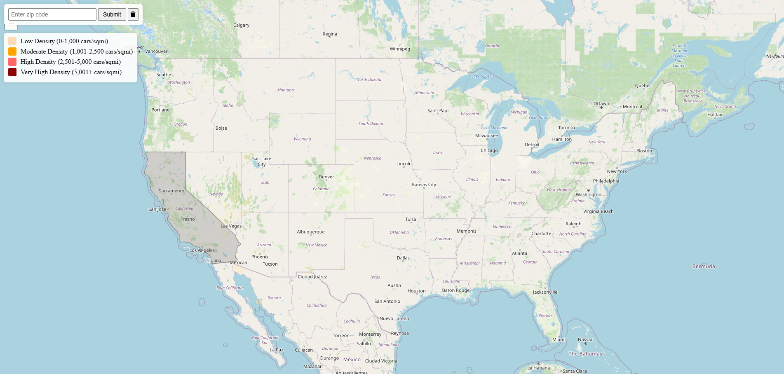

# ***Car Density Mapper***
This is a flask webapp that uses postgreSQL to store and then retrieve up-to-date information for a given zipcode. It gives a map interface for easy understanding of that data.



# Build Instructions
Prerequisites
* Python installed
* pip package manager installed

***Activate virtual environment linux<br>
To BUILD on linux you must have the psycopg2 pip package but it messes up the deployment so it cannot be inside of the requirement.txt***
```
python -m venv venv1
source venv1/bin/activate 
pip install -r requirements.txt
pip install psycopg2
```
***Activate virtual environment on windows and install packages***
```
python -m venv venv1
Set-ExecutionPolicy -Scope Process -ExecutionPolicy Bypass
venv1\Scripts\activate  
pip install -r requirements.txt
```

***Then to run on both windows and linux, do ...***
```
Windows -> python -m src.main
Linux   -> python3 -m src.main
```
